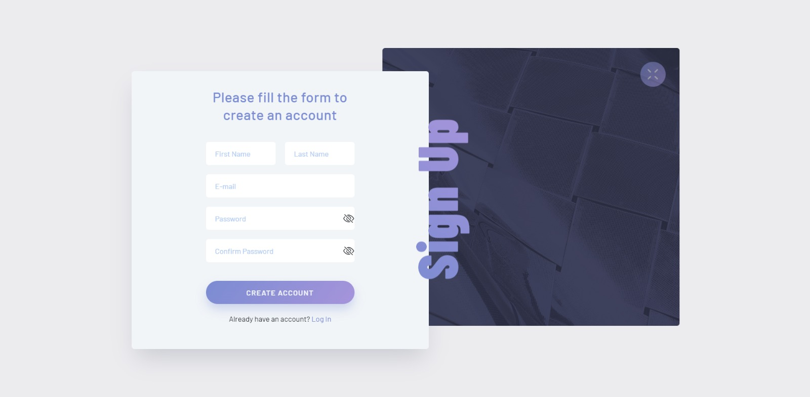
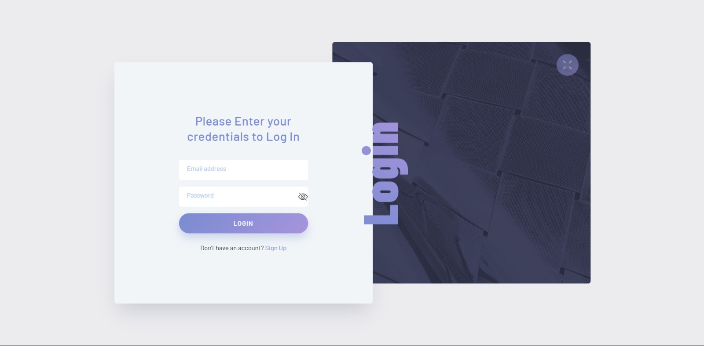

# Good Shoes

## Introduction

This repository contains the source code for a web application called Good Shoes. Good Shoes is an e-commerce platform focused on providing a seamless shopping experience for footwear enthusiasts. Whether you're looking for the latest trends or classic styles, Good Shoes has you covered.

## Features

### 1. Authentication System
- Users can register, log in, and log out securely.
- Session management and local storage are utilized for user authentication.
- Comprehensive validation ensures data integrity and security.




### 2. Product Display and Filtering
- All products are fetched from a JSON file.
- Users can filter products by categories, price, size, and color.


### 3. Shopping Cart
- Users can add products to their cart.
- The cart includes pricing information and allows users to apply promo codes for discounts.
- Users can adjust quantity, choose color and size for each item.


### 4. Checkout Process
- Users can provide additional information during checkout.
- Payment methods include Visa or cash, with thorough validation of user input.


### 5. Product Details
- Detailed product information is available.
- Users can add products to their cart, wishlist, or rate them.


### 6. Wishlist
- Users can add products to their wishlist for future reference.
- Wishlist items can be easily added to the cart for seamless ordering.


### 7. Order History
- Users can view details of their past orders in the order history page.


### 8. User Profile
- Each user has a dedicated profile where they can view and update their data, including profile picture.


### 9. Admin Dashboard
- Admins have access to a dashboard where they can perform CRUD operations on products (view, update, add, delete).


### 10. Additional Pages
- About Us, FAQ, Delivery Info, Privacy Policy, and Terms and Conditions are provided for user reference.

## Getting Started

To get started with Good Shoes, use the following commands:

```bash
git clone https://github.com/BasmalaMohamed46/Good-Shoes.git
cd Good-Shoes

## Contributing

We welcome contributions to improve Good Shoes! To contribute:

1. Fork the repository.
2. Create your feature branch (`git checkout -b feature/AmazingFeature`).
3. Commit your changes (`git commit -m 'Add some AmazingFeature'`).
4. Push to the branch (`git push origin feature/AmazingFeature`).
5. Open a pull request.

## License

This project is licensed under the MIT License.
