# Good Shoes

# Table of Contents

- [Demo Video](#demo-video)
- [Production Deployment](#production-deployment)
- [Features](#features)
  - [1. Landing Page](#landing-page)
  - [2. Authentication System](#authentication-system)
  - [3. Product Display and Filtering](#product-display-and-filtering)
  - [4. Shopping Cart](#shopping-cart)
  - [5. Checkout Process](#checkout-process)
  - [6. Product Details](#product-details)
  - [7. Wishlist](#wishlist)
  - [8. Order History](#order-history)
  - [9. User Profile](#user-profile)
  - [10. Additional Pages](#additional-pages)
  - [11. Admin Dashboard](#admin-dashboard)
- [Getting Started](#getting-started)
- [Contributing](#contributing)
- [License](#license)

## Introduction

This repository contains the source code for a web application called Good Shoes. Good Shoes is an e-commerce platform focused on providing a seamless shopping experience for footwear enthusiasts. Whether you're looking for the latest trends or classic styles, Good Shoes is the destination for the perfect pair of foot wear.

## Demo Video

To see a demonstration of the project in action, watch our demo video 

[](https://www.youtube.com/watch?v=xLORfV15zXo)

## Production Deployment

You can access the production deployment of [Good Shoes](https://basmalamohamed46.github.io/Good-Shoes/)

## Features

### 1. Landing Page
-The landing page showcases featured products and provides quick access to various sections of the website.

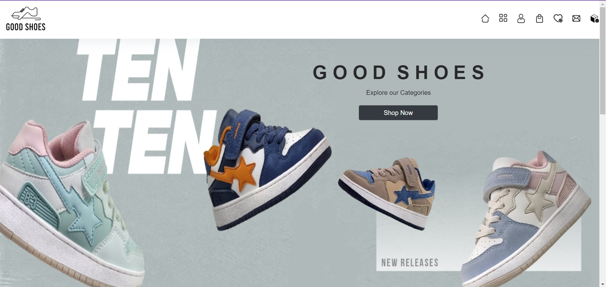
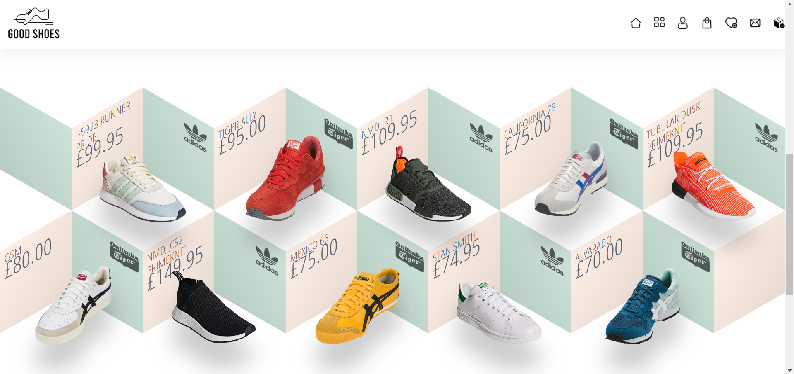
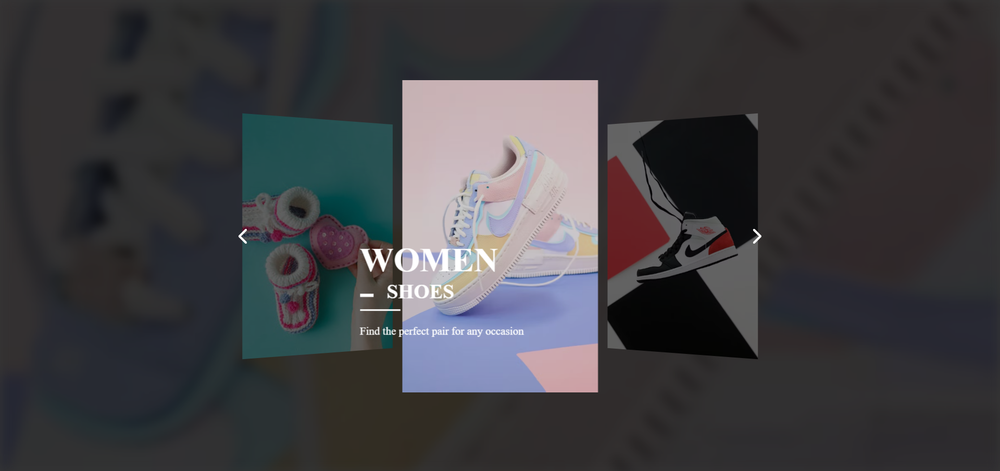

### 2. Authentication System
- Users can register, log in, and log out securely.
- Session management and local storage are utilized for user authentication.
- Comprehensive validation ensures data integrity and security.


### 3. Product Display and Filtering
- All products are fetched from a JSON file.
- Users can filter products by categories, price, size, and color.
- Users can search for a specific product

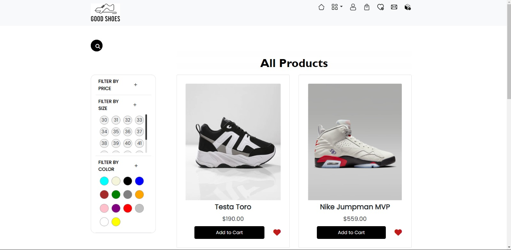
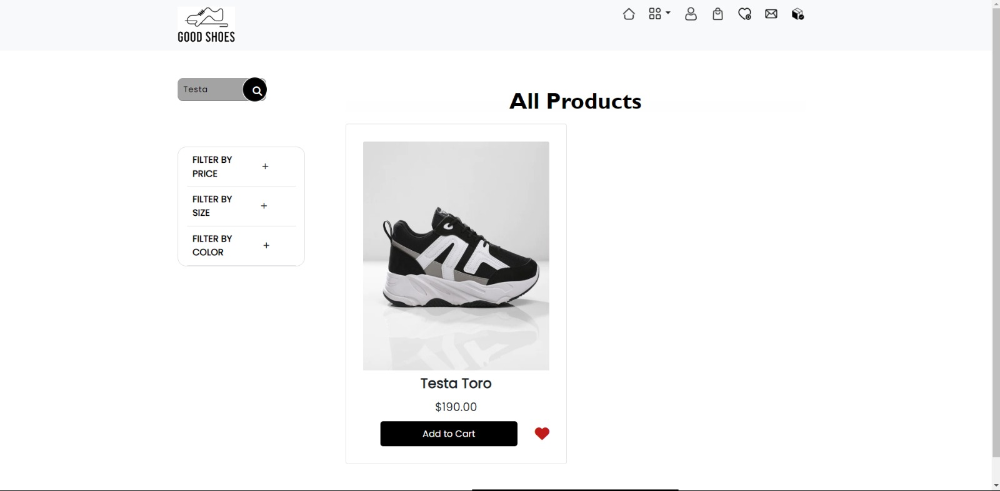

### 4. Shopping Cart
- Users can add products to their cart.
- The cart includes pricing information and allows users to apply promo codes for discounts.
- Users can adjust quantity, choose color and size for each item.
  
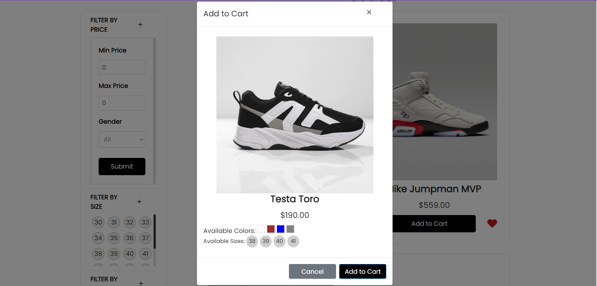
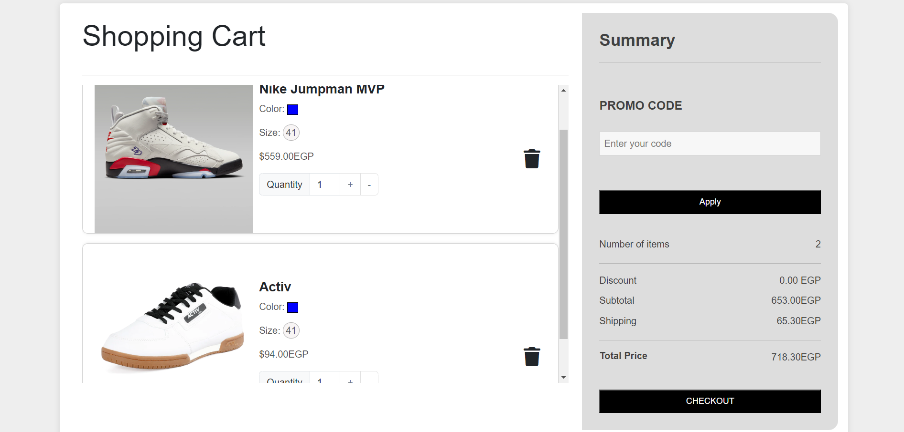

### 5. Checkout Process
- Users can provide additional information during checkout.
- Payment methods include Visa or cash, with thorough validation of user input.

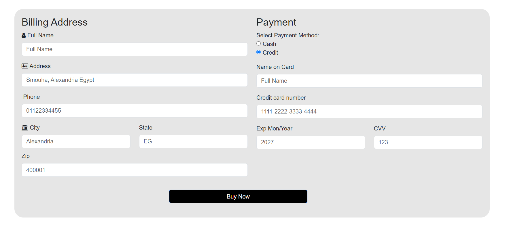
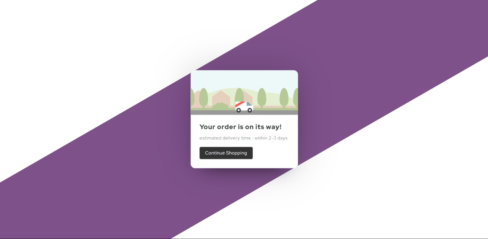

### 6. Product Details
- Detailed product information is available.
- Users can add products to their cart, wishlist, or rate them.

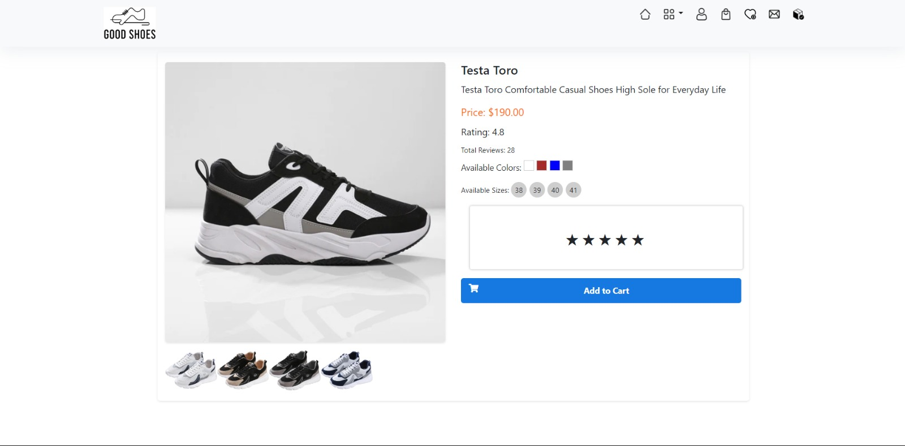

### 7. Wishlist
- Users can add products to their wishlist for future reference.
- Wishlist items can be easily added to the cart for seamless ordering.

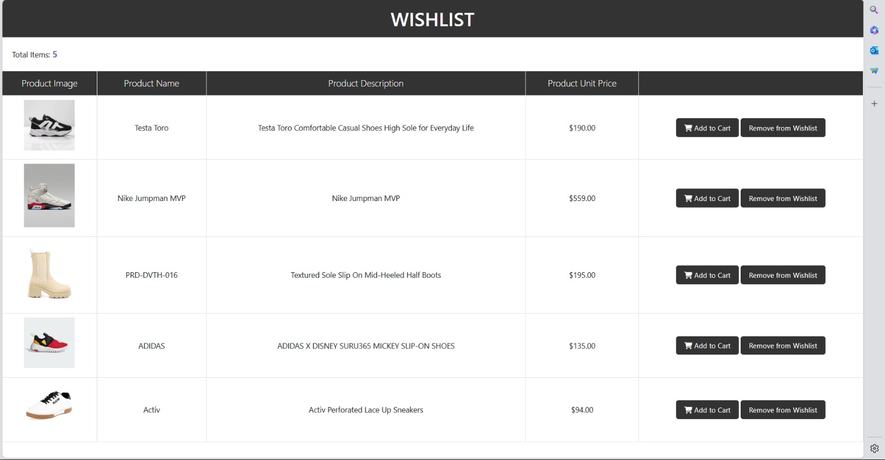

### 8. Order History
- Users can view details of their past orders in the order history page.

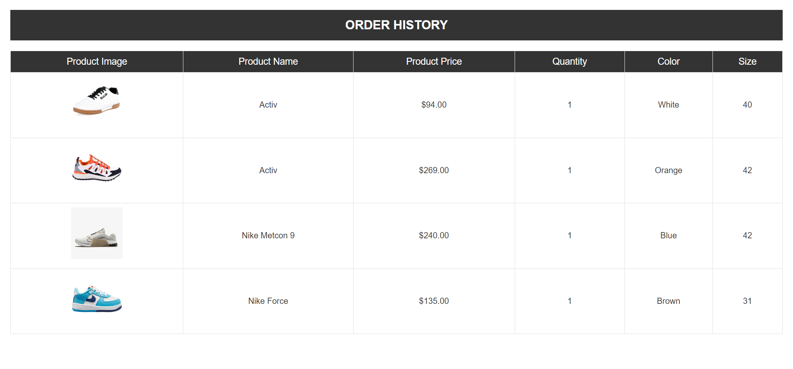

### 9. User Profile
- Each user has a dedicated profile where they can view and update their data, including profile picture.

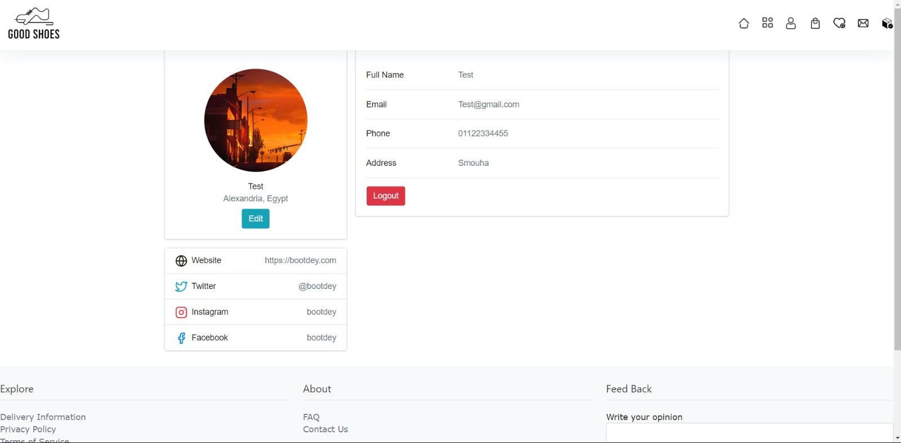

### 10. Additional Pages
- About Us, FAQ, Delivery Info, Privacy Policy, and Terms and Conditions are provided for user reference.

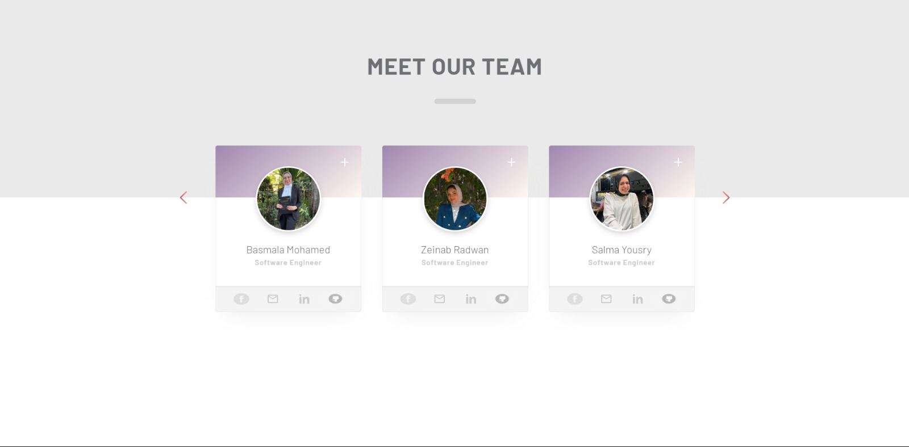
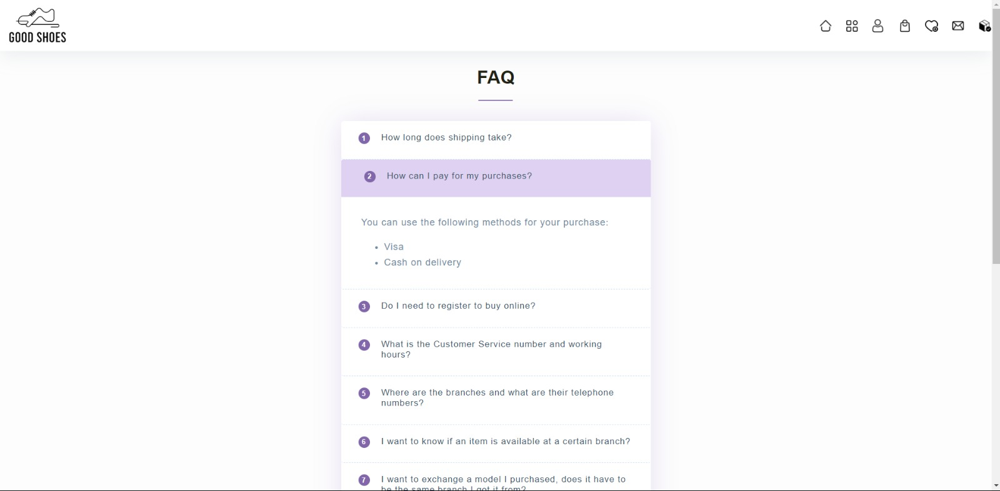
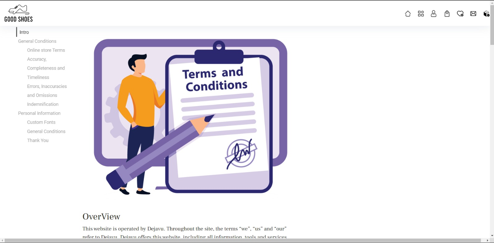

### 11. Admin Dashboard
- Admins have access to a dashboard where they can perform CRUD operations on products (view, update, add, delete).

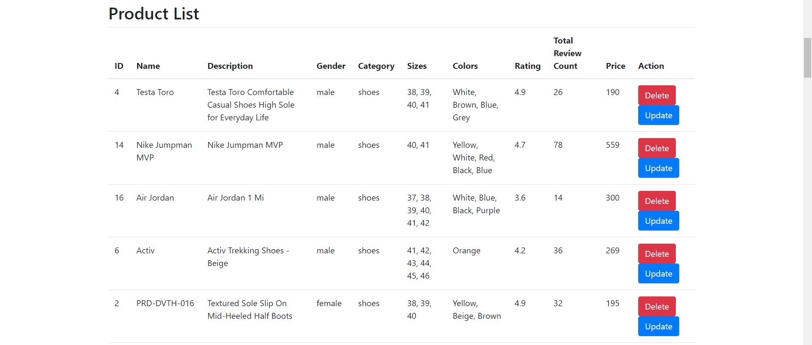
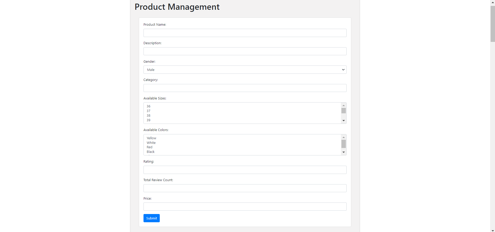

## Getting Started

To get started with Good Shoes, follow these steps:

1. **Clone the repository:**

```bash
git clone https://github.com/BasmalaMohamed46/Good-Shoes.git
```

2. **Open the project:**

```bash
cd Good-Shoes
```

3. **Open signUp.html file in your preferred web browser to explore the Good Shoes E-commerce website**


## Contributing

We welcome contributions to improve Good Shoes! To contribute:

1. Fork the repository.
2. Create your feature branch (`git checkout -b feature/AmazingFeature`).
3. Commit your changes (`git commit -m 'Add some AmazingFeature'`).
4. Push to the branch (`git push origin feature/AmazingFeature`).
5. Open a pull request.

## License

This project is licensed under the MIT License.


